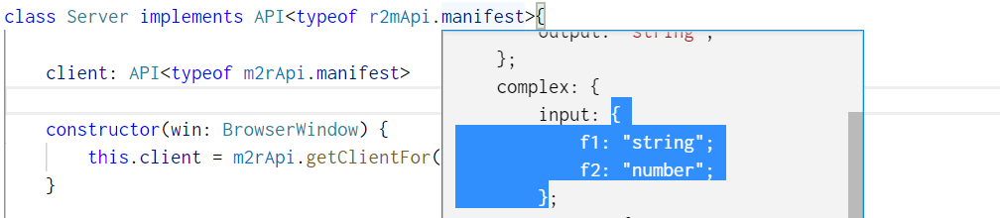
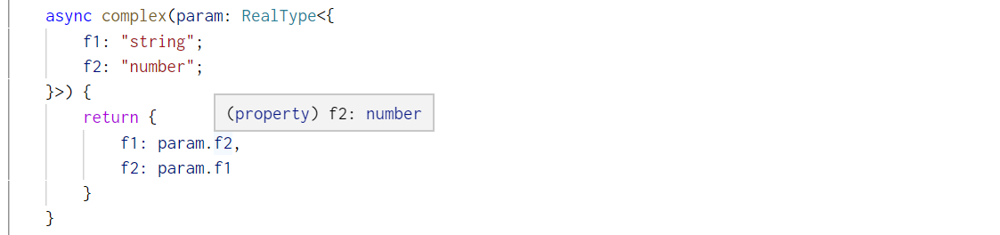

# Autumn Electron IPC

This library is used to create well typed IPC API for [Electron](https://www.electronjs.org). Within a Typescript environment, this library confirms the consistency between callers and callees.

 [Home Page Here](https://handiwork/github.io/autumn-electron-ipc/)

 ## Install
 ```bash
 yarn add https://github.com/Handiwork/autumn-electron-ipc.git
 ```

## Get Started

In this chapter, we will create an render-to-main API, which calls from renderer process and works on main process.

### Step 1: create an IPC bridge

```typescript
// in common file,
// shared by both main process and renderer process

export const r2mApi = createR2MApi("r2m-channel",{
    hello: {
        input: ["optional", "string"],
        output: "string"
    },
    complex: {
        input: {
            f1: "string",
            f2: "number"
        },
        output: {
            f1: "number",
            f2: "string"
        }
    },
    sigOk: {}
})
```

---
***NOTE***

If you want to create a manifest object with typing assistance, do use `checkManifest` function, this function checks your manifest and preserve the original type.
```typescript
const manifest = checkManifest({
    hello: {
        input: ["array", "string"],
        output: "string"
    },
})
export r2mApi = createR2MApi("my-special-channel" , manifest)
```

***DO NOT*** type like this:

```typescript
const manifest: IPCManifest = {
    hello: {
        input: ["array", "string"],
        output: "string"
    }
}
export r2mApi = createR2MApi("my-special-channel", manifest) 
```
---

### Step 2: plug the bridge into the worker in main process

```typescript
// in main process 

class Server implements API<typeof r2mApi.manifest>{

    async hello(who?: string) {
        return `hello ${who | "guest"}`
    }

    async complex(param: RealType<{
        f1: "string";
        f2: "number";
    }>) {
        return {
            f1: param.f2,
            f2: param.f1
        }
    }

    async sigOk() {
         /* some code */
    }
}

async function bootstrap() {
    await app.whenReady()
    let win = new BrowserWindow(/* options */)
    //*************************************
    const server = new Server()
    r2mApi.plugInMain(server)
    //*************************************
    win.loadFile(/* file */)
    win.show()
}

bootstrap()
```
While IDEs cant not auto generate interface template from a `type`, you can use the hint of manifest and copy the definition.



Wrap it with `RealType`, then parameter hint works:




### Step 3: create and use client in renderer process
```typescript
// in renderer process, preload script preferred

export async function bootstrap(log:(string)=>void) {
    const client = r2mApi.getClient()
    log(`client.hello("Autumn"): ${await client.hello("Autumn")}`)
    log(`client.hello(): ${await client.hello()}`)
    const r = JSON.stringify(await client.complex({ f1: "nine", f2: 9 }))
    log(`client.complex({ f1: "nine", f2: 9 })}: ${r}`)
    log(`client.sigOk(): ${await client.sigOk()}`)
}
```

That's all.

To create an **main-to-renderer** API, which calls from main process and works on renderer process, use `createR2MApi(...)` instead, then call `plugInRenderer(...)` in renderer precess, and call `getClientFor(...)` in main process to get a client.

## Manifest Supported Types

This lib supports part of **primitives**:

- undifined: `undifined`
- string: `"string"`
- number: `"number"`
- bigint: `"bigint"`
- boolean `"boolean"`

some **structure**:

- array: `["array", <non undifined type>]`
- object: `{ <key>: <type>}`

for signature:
- optional: `["optional", <non undifined type>]`

## APIs
Source code generated docs are [here](https://handiwork.tollife.cn/autumn-electron-ipc/api/).


